# Ares Architecture

Ares separates model reasoning from security authority. A model may propose work inside a bounded interface, but deterministic Ares components own scope, task construction, policy, approvals, persistence, evidence, and reporting.

```mermaid
flowchart LR
    O[Operator] --> S[CLI / TUI / Dashboard]
    S --> G[Gateway or Local Runtime]
    G --> R[Router and Mission Coordinator]
    R --> M[Model Adapter or Deterministic Profile]
    M --> P[Planner Decision or Tool Request]
    P --> C[Trusted Task Compiler]
    C --> D[Dispatcher]
    D --> Q[Scope / ROE / Risk / Approval / Route Policy]
    Q --> T[Registered Tool Adapter]
    T --> E[Untrusted Tool Result]
    E --> DB[(StateDB)]
    DB --> X[Evidence Index / Attack Surface / Coverage / Findings]
    X --> M
    X --> REP[Reports and Operator Events]
    REP --> S
```



## Authority boundaries

### Operator

The operator declares the authorized target, scope, risk ceiling, execution path, model configuration, and required approvals. Advanced validation begins from an operator-supplied task graph.

### Model

The model produces text, structured tool requests, or a coverage selection depending on the execution path. Model output is untrusted and never authorizes itself.

### Router and coordinator

The router selects a configured agent profile. The mission coordinator owns mission identity, phase, task dependencies, profile contracts, resume compatibility, and task budget.

### Governed planner

Autonomous reconnaissance receives a bounded view of the attack-surface graph and pending coverage ledger. It may return only an exact coverage ID. It receives no callable tools and cannot construct a target or argument set.

### Trusted task compiler

Ares maps a valid coverage ID to a fixed capability, tool, target, and argument set. Unsupported capability or subject combinations fail closed before dispatch.

### Dispatcher and policy

The dispatcher revalidates every call. It owns:

- target and path scope
- rules of engagement
- risk ceilings
- approval requirements
- duplicate suppression
- route policy
- timeouts
- tool availability
- recording and event provenance

No prompt can override these checks.

### Tool adapters

Tool adapters expose bounded schemas and normalize execution. GhostMCP adds an independent engagement-policy boundary. OnionClaw is exposed only through the curated Ares adapter surface.

### State and evidence

SQLite persists sessions, messages, tool calls, hosts, services, memory chunks, missions, tasks, attack-surface graph nodes and edges, coverage items, planner cycles, recovery attempts, findings, and approval receipts.

Tool output and target content are stored as untrusted evidence. Evidence recall remains target-bound. Advanced approval evidence must be successful, non-empty, same-mission, and same-target.

## Execution paths

### Supervised runtime

`ares run` sends a bounded task to the model. The model may request registered tools, but every request passes through the dispatcher.

### Deterministic mission

A named mission profile or explicit task graph defines the work. The coordinator validates the graph and runs fixed task contracts without model-authored planning.

### Governed autonomous reconnaissance

Ares creates and refreshes coverage requirements from persisted evidence. The model selects a pending coverage ID. Ares compiles and dispatches the corresponding fixed task. Results update the graph, coverage, recovery state, and conservative finding hypotheses.

### Authorized operator validation

The operator supplies advanced tasks. Ares requires same-mission evidence, an exact contract, an unexpired single-use receipt bound to the task digest, GhostMCP policy where applicable, and explicit high-risk approval. The model does not select these tasks.

## Finding lifecycle

```text
observed -> hypothesized -> corroborated -> safely_validated -> reported
```

Supporting and contradictory evidence, confidence rationale, severity rationale, reproduction steps, and limitations are persisted. Version-only observations cannot satisfy safe validation by themselves.

## Recovery

Reconnaissance recovery is deterministic and limited to one trusted equivalent attempt per coverage item. Recovery uses the same mission task budget as the original dispatch. A second failure is reported as inconclusive rather than hidden or retried indefinitely.

## Operator surfaces

The gateway, dashboard, and TUI share runtime and state contracts but remain separate components:

- the gateway owns API and control-plane behavior
- the dashboard owns browser presentation
- the TUI owns terminal interaction

This separation prevents browser behavior from becoming an implicit security authority.

## Release boundary

The supported compatibility contract is documented in [v1-support-boundary.md](v1-support-boundary.md). Exact prompt wording, planner ranking among valid options, and visual styling are not stable security contracts.
