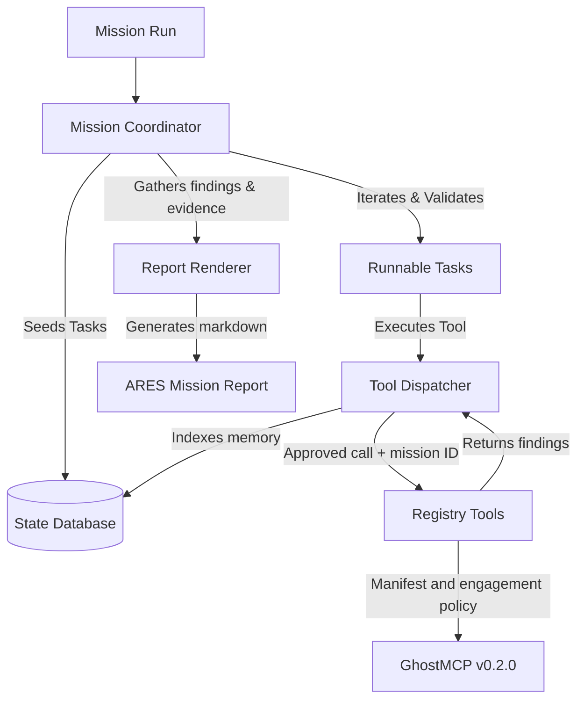

# ARES Swarm Testing Missions

Swarm Testing Missions allow ARES to coordinate multiple agent roles dynamically
to achieve higher coverage, validate hypotheses against security policies, and
output a verified markdown report without raw secrets exposure.

The operator catalog includes Ares's `validator` role and the eight T3MP3ST
archetypes: `coordinator`, `recon`, `scanner`, `exploiter`, `infiltrator`,
`exfiltrator`, `ghost`, and `analyst`.

The four advanced roles are native Ares adaptations, not copied T3MP3ST prompt
text. They remain behind the central `ToolDispatcher`, explicit mission risk
ceilings, phase restrictions, and per-role tool allowlists. Their names describe
the security control being validated:

- `exploiter`: minimum-proof exploit validation; maximum risk `exploit`
- `infiltrator`: authorized lateral-movement validation; maximum risk `post-exploitation`
- `exfiltrator`: bounded data-exposure validation, never bulk removal
- `ghost`: persistence-control validation, never persistence installation or concealment

Adding an operator role does not automatically authorize it. A task is rejected
unless its mission ID, phase, toolset, exact tool, target scope, and risk ceiling
all pass validation. Exploit and post-exploitation tool dispatches additionally
require the existing out-of-model approval callback.

GhostMCP adds an independent authorization boundary. Intrusive or sensitive
tasks require its mode-`0600` engagement policy, expiration, explicit scope,
capabilities, and approval provenance. Ares consumes GhostMCP manifest schema
`1.0`, binds each call to the Ares mission ID, and cannot widen the GhostMCP
scope.

Advanced tasks use the separate `authorized-operator-validation` profile. The
ordinary source, secrets, dependency, and report profiles do not enable these
roles or the `ghostmcp` toolset.

## Concepts
- **Mission Profiles**: Pre-defined configurations containing enabled toolsets and metadata.
- **Mission Coordinator**: Manages tasks dependencies, allowed path scopes, and executes the state machine loop.
- **State Database**: Stores missions, tasks, findings, and operator runs.

## Architecture Diagram

